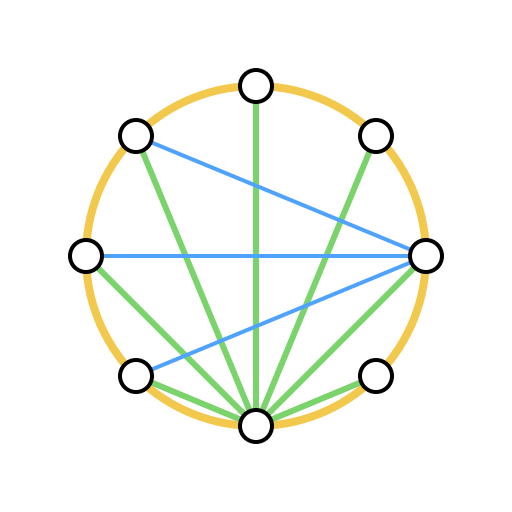
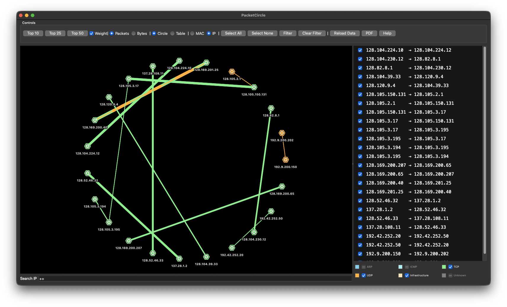
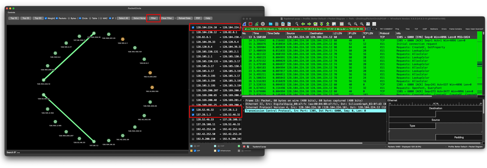
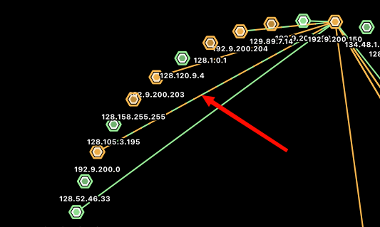
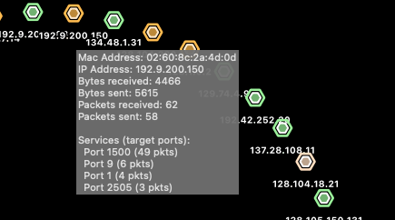

# PacketCircle

<p align="center">
  
</p>

[](CHANGELOG.md)
[](CHANGELOG.md)
[](LICENSE)
[](https://www.wireshark.org/)
[](https://www.qt.io/)
[](installer/macos-universal/)
[](installer/linux-x86_64/)
[](installer/windows-x86_64/)

A native Wireshark plugin that visualizes network communication pairs in an interactive circle diagram with protocol color coding, traffic volume indicators, and PDF report export.

> **Beta Status**: This is version 0.2.2, a public beta release. While fully functional, the software is under active development. Please report any issues you encounter.

## Features

- **Circle Visualization** - Interactive circular graph showing communication relationships between network endpoints
- **Protocol Color Coding** - Lines colored by transport protocol (TCP, UDP, ICMP, ARP, SCTP, etc.)
- **Multicolor Lines** - Connections using both TCP and UDP are drawn as dotted lines with alternating colors, making mixed-protocol communication instantly visible
- **Line Weight** - Proportional to packet/byte volume for at-a-glance traffic assessment
- **Rich Tooltips** - Hover over nodes to see IP address, packet counts, destination ports, and service names in a detailed popup
- **Directional Filtering** - Select individual communication pairs to apply precise unidirectional Wireshark display filters
- **Protocol Filtering** - Filter the visualization by specific protocols using interactive checkboxes
- **PDF Report Export** - Generate a one-page PDF report with the circle visualization, IP pair table, and summary text
- **Multiple Views** - Toggle between circle view and table view
- **Conversation Limits** - Limit display to top 10, 25, or 50 conversations
- **Live Capture Support** - Works with both loaded PCAP files and live captures
- **Cross-Platform** - macOS Universal Binary (Intel + Apple Silicon), Linux x86_64, Windows x86_64

## Screenshots

### PacketCircle Visualization

Access the plugin from the Wireshark menu: **Tools -> PacketCircle**



*Interactive circle visualization showing network communication pairs with protocol color coding*



*Setting a filter based on the visualization*

### Multicolor Lines

Connections that use both TCP and UDP are drawn as dotted lines with alternating colors, making mixed-protocol communication instantly visible.



*Dotted multicolor lines indicate endpoints communicating over both TCP and UDP*

### Rich Tooltips

Hover over any node to see a detailed popup with IP address, total packet count, destination ports, and resolved service names.



*Node tooltip showing destination ports and service names*


## Quick Start

> **Important**: Pre-built binaries are available for all major platforms. macOS and Windows target **Wireshark 4.6.x**. The Linux unified installer supports **4.2.x, 4.4.x, and 4.6.x** and auto-detects your version. See [Supported Wireshark Versions](#supported-wireshark-versions).

### Installation

#### macOS (Intel & Apple Silicon) — Wireshark 4.6.x
```bash
git clone https://github.com/netwho/PacketCircle.git
cd PacketCircle/installer/macos-universal
chmod +x install.sh
./install.sh
```

#### Windows (x86_64) — Wireshark 4.6.x
```powershell
git clone https://github.com/netwho/PacketCircle.git
cd PacketCircle\installer\windows-x86_64
.\install.ps1
```

#### Linux (x86_64) — Wireshark 4.2.x / 4.4.x / 4.6.x
```bash
git clone https://github.com/netwho/PacketCircle.git
cd PacketCircle/installer/linux-x86_64
chmod +x install.sh
./install.sh
```

The unified Linux installer auto-detects your Wireshark version and installs the matching binary.

#### Manual Install

> **Note**: macOS uses **dashes** (`4-6`), Linux uses **dots** (`4.2`, `4.4`, `4.6`), Windows uses **dashes** (`4-6`) in the plugin directory name.

```bash
# macOS (Wireshark 4.6.x)
mkdir -p ~/.local/lib/wireshark/plugins/4-6/epan/
cp installer/macos-universal/packetcircle.so ~/.local/lib/wireshark/plugins/4-6/epan/

# Linux — pick the binary matching your Wireshark version:
# bin/packetcircle-ws42.so  → Wireshark 4.2.x
# bin/packetcircle-ws44.so  → Wireshark 4.4.x
# bin/packetcircle-ws46.so  → Wireshark 4.6.x
mkdir -p ~/.local/lib/wireshark/plugins/4.4/epan/
cp installer/linux-x86_64/bin/packetcircle-ws44.so ~/.local/lib/wireshark/plugins/4.4/epan/packetcircle.so
```

```powershell
# Windows (Wireshark 4.6.x) — run in PowerShell
Copy-Item installer\windows-x86_64\packetcircle.dll "$env:APPDATA\Wireshark\plugins\4-6\epan\"
```

> **Tip**: Check your exact plugin path in Wireshark under Help -> About Wireshark -> Folders -> Personal Plugins.

### Usage

1. **Load a capture file** in Wireshark (or start a live capture)
2. **Open PacketCircle**: Tools -> PacketCircle
3. **Explore**: Hover over nodes for details, click pairs to filter
4. **Export**: Click "PDF" to generate a report

See [QUICKSTART.md](QUICKSTART.md) for a detailed guide.

## Controls

| Control | Description |
|---------|-------------|
| **Top 10 / 25 / 50** | Limit visible conversations |
| **Packets / Bytes** | Switch metric for line weight |
| **Circle / Table** | Toggle visualization mode |
| **MAC / IP** | Switch between MAC and IP address pairs |
| **Select All / None** | Bulk pair selection |
| **Filter** | Apply Wireshark display filter for selected pairs |
| **Clear Filter** | Reset Wireshark display filter and show all connections |
| **PDF** | Export a one-page PDF report |
| **Protocol checkboxes** | Filter by specific protocols (TCP, UDP, HTTP, DNS, etc.) |
| **Line Thickness** | Toggle proportional line weight on/off |
| **Search** | Filter the IP pair list by address |

## PDF Report

The PDF export generates a professional one-page report including:

- **Header** with PacketCircle logo and report title
- **Summary text** describing the capture (packet count, unique hosts, time range)
- **Circle visualization** rendered with print-optimized colors (white background, high-contrast labels)
- **IP pair table** listing source, destination, packets, and bytes
- **Footer** with generation timestamp

## Architecture

```
src/
  circle_plugin.c/h      # Plugin entry point and Wireshark integration
  packet_analyzer.c/h    # Packet analysis engine, communication pair extraction
  circle_widget.c/h      # Qt widget for circle rendering, tooltips, PDF rendering
  ui_main_window.c/h     # Main window, controls, filter logic, PDF export
  ui_bridge.cpp/h        # C/C++ bridge for Wireshark plugin API
  plugin.c               # Plugin registration
  CMakeLists.txt         # Build configuration
  packetcircle.qrc       # Qt resource file (embedded assets)
```

## Building from Source

### Prerequisites

- Wireshark source code (matching your installed version, e.g., 4.6.3)
- CMake 3.10+
- Qt6 (Core, Widgets, Gui)
- GLib 2.54+
- C/C++ compiler (Clang recommended on macOS)

### Build Instructions

1. Place the `src/` contents into `plugins/epan/packetcircle/` within the Wireshark source tree
2. Configure and build:

```bash
cd wireshark-source
mkdir build && cd build
cmake -DCUSTOM_PLUGIN_SRC_DIR=plugins/epan/packetcircle ..
make packetcircle
```

3. The built plugin is at:
```
build/run/Wireshark.app/Contents/PlugIns/wireshark/4-6/epan/packetcircle.so
```

### Building a Universal Binary

To create a binary that works on both Intel and Apple Silicon Macs:

1. Build for arm64 (on Apple Silicon Mac with `/opt/homebrew` dependencies)
2. Install x86_64 Homebrew and dependencies at `/usr/local`
3. Build for x86_64 in a separate build directory
4. Merge with `lipo`:

```bash
lipo -create build-arm64/packetcircle.so build-x86_64/packetcircle.so -output packetcircle-universal.so
```

See [BUILD.md](src/BUILD.md) for detailed instructions.

## Supported Wireshark Versions

| Wireshark Version | macOS (Universal) | Windows x86_64 | Linux x86_64 |
|---|---|---|---|
| **4.6.x** (4.6.0 – 4.6.x) | Supported | Supported | Supported |
| **4.4.x** (4.4.0 – 4.4.x) | — | — | Supported |
| **4.2.x** (4.2.0 – 4.2.x) | — | — | Supported |
| 4.0.x | — | — | Build from source |

**macOS and Windows** ship with Wireshark 4.6.x builds only. On these platforms, Wireshark is typically installed or updated directly from [wireshark.org](https://www.wireshark.org/download.html), so running the latest 4.6.x release is straightforward.

**Linux** distributions often ship older Wireshark versions in their package repositories (e.g., Debian 13 Trixie ships 4.4.x, some distributions still carry 4.2.x). The unified Linux installer (`installer/linux-x86_64/`) includes binaries for all three series and automatically selects the right one.

> **Why separate binaries?** Wireshark uses a versioned plugin ABI (`MAJOR.MINOR`). Each minor release series (4.0, 4.2, 4.4, 4.6) has its own ABI. Pre-built plugins only load in the matching series.

## Requirements

- **Wireshark** 4.6.x (macOS/Windows) or 4.2.x–4.6.x (Linux), or any 4.x if building from source
- **macOS** 13.0 or later (Ventura+) — Universal Binary (Intel + Apple Silicon)
- **Windows** 10/11 x86_64 — Wireshark 4.6.x with Qt6
- **Linux** x86_64 — Ubuntu 22.04+, Debian 12+/13, Fedora 39+, or similar with Qt6
- No additional runtime dependencies beyond what Wireshark provides

## Documentation

- **[QUICKSTART.md](QUICKSTART.md)** - 5-minute getting started guide
- **[CHANGELOG.md](CHANGELOG.md)** - Version history
- **[LICENSE](LICENSE)** - GNU GPL v2

## Troubleshooting

### `dlopen` Error: Library not loaded / Symbol not found

This is the most common error and means **your Wireshark version doesn't match the plugin binary**.

**Example errors:**
- `Library not loaded: @rpath/libwireshark.19.dylib` — you installed the 4.6.x binary but have Wireshark 4.4.x or 4.2.x.
- `Library not loaded: @rpath/libwireshark.18.dylib` — you installed the 4.4.x binary but have Wireshark 4.6.x.
- `Symbol not found: _some_function_name` — similar ABI mismatch between your Wireshark and the plugin.

**Fix:** Use the unified Linux installer (`installer/linux-x86_64/`) which auto-detects your version, or build from source (see [Building from Source](#building-from-source)).

### Plugin Not Appearing in Tools Menu

**Check:**
1. Your Wireshark version matches the plugin binary (Help -> About Wireshark)
2. Plugin is in the correct directory:
   - macOS (4.6.x): `~/.local/lib/wireshark/plugins/4-6/epan/`
   - Windows (4.6.x): `%APPDATA%\Wireshark\plugins\4.6\epan\`
   - Linux (4.2.x): `~/.local/lib/wireshark/plugins/4.2/epan/`
   - Linux (4.4.x): `~/.local/lib/wireshark/plugins/4.4/epan/`
   - Linux (4.6.x): `~/.local/lib/wireshark/plugins/4.6/epan/`
3. File has correct permissions: `chmod 644 packetcircle.so` (Linux/macOS)
4. Wireshark was restarted after installation
5. Verify the exact path: Help -> About Wireshark -> Folders -> Personal Plugins

**Fix (Linux/macOS):**
```bash
# Find your plugin (check all possible locations)
ls -la ~/.local/lib/wireshark/plugins/*/epan/packetcircle.so

# Fix permissions
chmod 644 packetcircle.so
```

> **Common Linux issue**: If you installed to `4-6` (dashes) on Linux, move the file to `4.6` (dots). Linux Wireshark uses dots in the plugin version directory.

> **DBus warnings**: Messages like "Session DBus not running" are harmless Qt warnings and do not prevent the plugin from loading.

### Windows: Plugin Not Loading (especially Windows 10)

The plugin has been verified on Windows 11 but may fail to load on Windows 10 due to differences in DLL search paths, VC++ runtime versions, or internet download blocking.

**Quick checks:**
1. **Unblock the DLL** - If you downloaded the plugin from GitHub, Windows may silently block it. Right-click `packetcircle.dll` -> Properties -> check **Unblock** -> Apply. Or in PowerShell:
   ```powershell
   Unblock-File "$env:APPDATA\Wireshark\plugins\4.6\epan\packetcircle.dll"
   ```
2. **Install the latest VC++ Redistributable** - Download and install [VC++ 2022 Redistributable (x64)](https://aka.ms/vs/17/release/vc_redist.x64.exe)
3. **Verify the plugin directory** - Check Help -> About Wireshark -> Folders -> Personal Plugins for the exact path Wireshark expects, then confirm the DLL is in the `epan` subdirectory
4. **Check Wireshark's debug log:**
   ```cmd
   "C:\Program Files\Wireshark\Wireshark.exe" -o log.level:debug 2> debug.txt
   ```
   Search `debug.txt` for `packetcircle` to find loading errors.

**Automated diagnostics:** Run the troubleshooting script from the [`tools/`](tools/) directory:

```powershell
.\troubleshoot.ps1
```

This script checks all DLL dependencies, verifies the plugin directory, tests DLL loading, detects internet download blocks, and reports exactly what is wrong. No extra software needed - it runs natively on any Windows 10/11 machine. See [`tools/README.md`](tools/README.md) for details.

### Plugin Loads but Crashes

- Ensure you're using a compatible Wireshark version (4.6.x for macOS/Windows; 4.2.x, 4.4.x, or 4.6.x for Linux)
- Check that the binary matches your architecture (`file packetcircle.so`)
- Try reinstalling using the appropriate installer for your platform

### PDF Export Issues

- Ensure a capture file is loaded before exporting
- Check that at least one communication pair exists in the visualization

## License

GNU General Public License v2 - see [LICENSE](LICENSE) file for details.

This program is free software; you can redistribute it and/or modify it under the terms of the GNU General Public License as published by the Free Software Foundation; either version 2 of the License, or (at your option) any later version.

## Acknowledgments

- Wireshark development team for the plugin framework and Qt integration
- Network analysis community for feedback and testing
- AI-Assisted: yes (Claude) — used for build system automation, installer scripting, cross-platform compatibility, and documentation

## Support & Contact

- **Issues**: [GitHub Issues](https://github.com/netwho/PacketCircle/issues)
- **Documentation**: See docs in this repository

---

**Built with ❤️ for the network analysis community** — [github.com/netwho/PacketCircle](https://github.com/netwho/PacketCircle)
