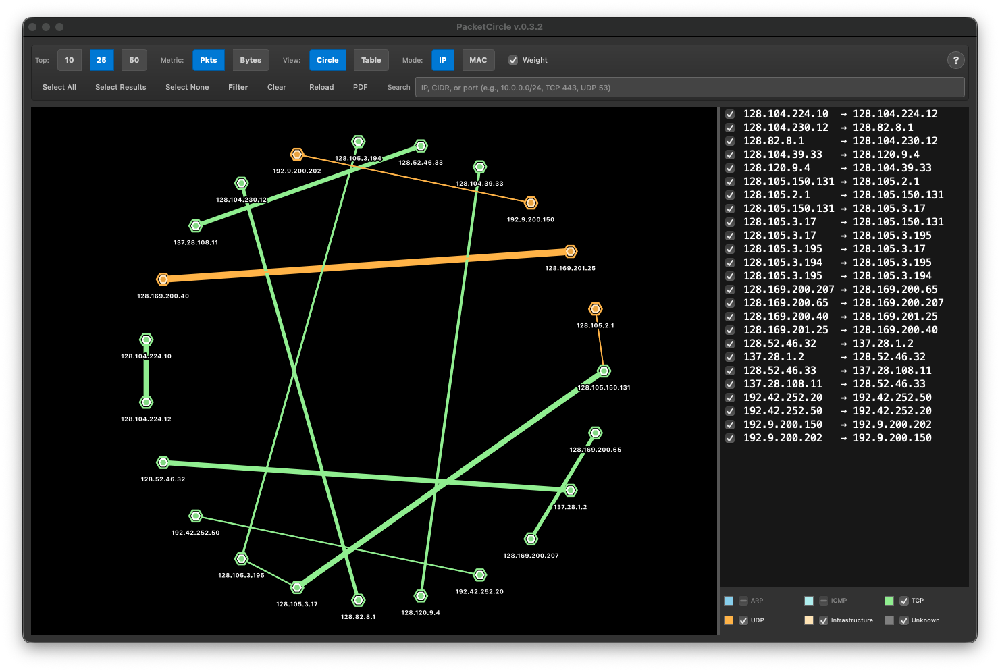
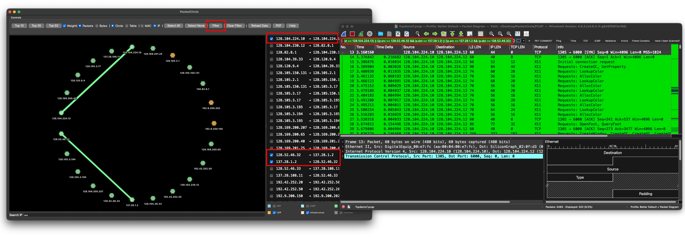
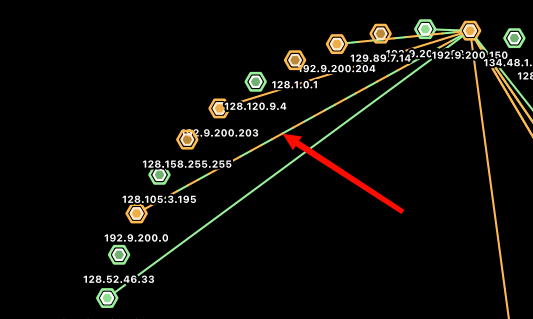
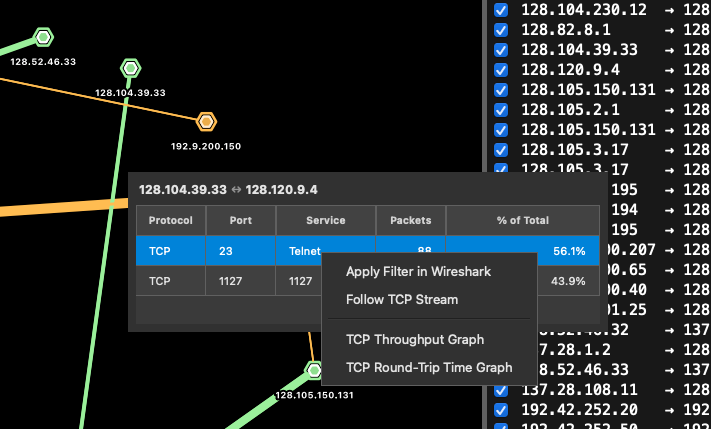
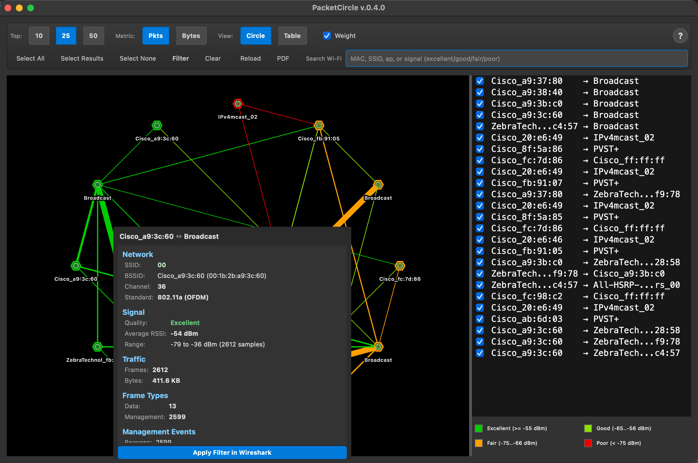
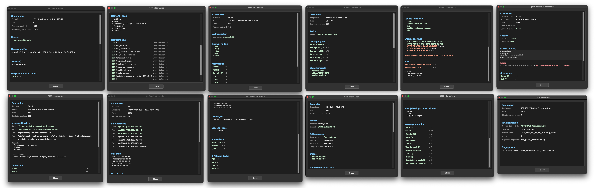
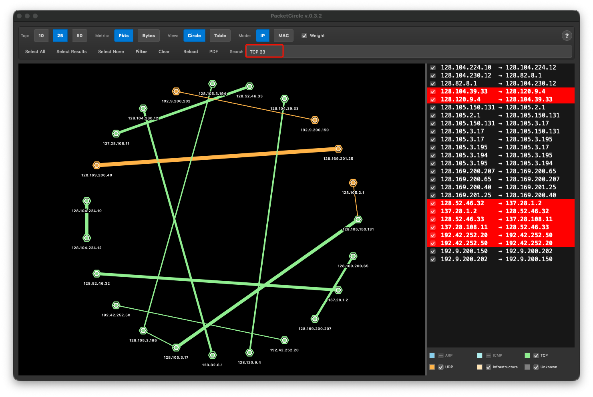
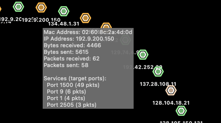

# PacketCircle

<p align="center">
  
</p>

[](CHANGELOG.md)
[](CHANGELOG.md)
[](LICENSE)
[](https://www.wireshark.org/)
[](https://www.qt.io/)
[](installer-v.0.4.x/macos-universal/)
[](installer-v.0.4.x/linux-x86_64/)
[](installer-v.0.4.x/windows-x86_64/)

A native Wireshark plugin that visualizes network communication pairs in an interactive circle diagram with protocol color coding, traffic volume indicators, and PDF report export.

> **Beta Status**: This is version 0.4.1, a public beta release. While fully functional, the software is under active development. Please report any issues you encounter.

## Demo

▶️ **[Watch the intro video on YouTube](https://youtu.be/jg4O9rdUp_0)** — see PacketCircle in action in under 4 minutes.

▶️ **[Watch the v.0.4.x feature video on YouTube](https://www.youtube.com/watch?v=Q83vcK8hXJo)** — protocol info dialogs, Wi-Fi mode, bidirectional pair filtering, and more.

## Features

- **Circle Visualization** - Interactive circular graph showing communication relationships between network endpoints
- **Protocol Color Coding** - Lines colored by transport protocol (TCP, UDP, ICMP, ARP, SCTP, etc.)
- **Multicolor Lines** - Connections using both TCP and UDP are drawn as dotted lines with alternating colors, making mixed-protocol communication instantly visible
- **Line Weight** - Proportional to packet/byte volume for at-a-glance traffic assessment
- **Rich Tooltips** - Hover over nodes to see IP address, packet counts, destination ports, and service names in a detailed popup
- **Directional Filtering** - Select individual communication pairs to apply precise unidirectional Wireshark display filters
- **Connection Popup** - Click a line in the circle to see port-level connection details with protocol, service name, and packet counts
- **Connection Context Menu** - Right-click a connection to apply a filter, follow a TCP stream, or open TCP throughput / round-trip time graphs
- **Protocol Information Dialogs** *(new in v0.4.0)* - Right-click a connection to view deep protocol details extracted from packet dissection:
  - **TLS/SSL** - Certificate details (subject, issuer, validity, SANs), cipher suites, TLS version, ALPN, SNI, JA3/JA4 fingerprints
  - **HTTP** - Request/response headers, methods, status codes, URIs, content types, server info, cookies
  - **SMB/CIFS & DCE/RPC** - Share access, file operations, named pipes, RPC interfaces and operations
  - **Kerberos** - Ticket details (TGT/TGS), principals, realms, encryption types, pre-auth data, SPN
  - **Email (SMTP/IMAP/POP3)** - Senders, recipients, subjects, server responses, authentication, mailbox operations
  - **SQL Databases (MSSQL/MySQL/PostgreSQL)** - Queries, database/schema, authentication, server version, error messages
  - **VoIP/SIP** - Call IDs, SIP methods/status codes, user agents, RTP payload types, SSRC, H.223 mux info
- **Search** - Search by IP address, CIDR range, port (e.g., `TCP 443`, `UDP 53`), or protocol category (`TCP`, `UDP`, `ARP`, `ICMP`, `Infrastructure`, `Unknown`) with blinking red highlights; protocol category search *(new in v0.4.0)*
- **Select Search Results** - After a search, select only the matching pairs with one click — works with IP, port, and category searches
- **Protocol Filtering** - Filter the visualization by specific protocols using interactive checkboxes; toggling a category also syncs the pair list checkboxes *(new in v0.4.0)*
- **Theme-Aware UI** - Automatically adapts to light and dark themes
- **PDF Report Export** - Generate a one-page PDF report with the circle visualization, IP pair table, and summary text
- **Multiple Views** - Toggle between circle view and table view
- **Conversation Limits** - Limit display to top 10, 25, or 50 conversations
- **Wi-Fi Monitoring Mode** *(new in v0.4.0)* - Switch to Wi-Fi mode to visualize 802.11 wireless communication with RSSI-based signal-quality color coding. Connection lines are colored green (Excellent), yellow (Good), orange (Fair), or red (Poor) based on measured signal strength. Click any node to see SSID, BSSID, channel, 802.11 standard, per-node signal statistics (average RSSI, range, sample count), traffic volume, frame type breakdown, and management events. Search by MAC address, SSID, or signal quality keyword (`excellent`, `good`, `fair`, `poor`)
- ~~**Live Capture Support** - Works with both loaded PCAP files and live captures~~ *(considered for v0.5.x)*
- **Single-Row Bidirectional Pairs** *(new in v0.4.1)* - The connection pair list shows one row per bidirectional connection. Click the row (outside the checkbox) to cycle the arrow between **→** (A→B filter only), **↔** (both directions, default), and **←** (B→A only). "Apply Filter" respects the chosen direction
- **IPv6 Display Filters** *(fixed in v0.4.1)* - Filter strings now correctly use `ipv6.src`/`ipv6.dst` for IPv6 addresses instead of `ip.src`/`ip.dst`
- **MAC Truncation Adapts to Width** *(fixed in v0.4.1)* - MAC addresses in the pair list now resize dynamically with the splitter, matching the behaviour of IP addresses and hostnames
- **MAC Mode Persists Across Restarts** *(fixed in v0.4.1)* - Saving in MAC mode and reopening PacketCircle now correctly loads pair data in MAC mode immediately, without requiring a manual toggle
- **Cross-Platform** - macOS Universal Binary (Intel + Apple Silicon), Linux x86_64, Windows x86_64

## Screenshots

### PacketCircle Visualization

Access the plugin from the Wireshark menu: **Tools -> PacketCircle**



*Interactive circle visualization showing network communication pairs with protocol color coding*



*Setting a filter based on the visualization*

### Multicolor Lines

Connections that use both TCP and UDP are drawn as dotted lines with alternating colors, making mixed-protocol communication instantly visible.



*Dotted multicolor lines indicate endpoints communicating over both TCP and UDP*

### Connection Popup & TCP Stream Analysis

Click any line in the circle to open a connection popup showing per-port details. Right-click a row to apply a Wireshark display filter, reassemble and follow a TCP stream, or launch Wireshark's TCP throughput and round-trip time statistics graphs -- all directly from within PacketCircle.



*Connection popup with port-level details and context menu*

### Wi-Fi Monitoring Mode

Switch to Wi-Fi mode to visualize 802.11 wireless communication directly from a WLAN capture. Connection lines are color-coded by RSSI signal quality — green for Excellent, yellow for Good, orange for Fair, and red for Poor — giving an instant overview of wireless link health across the network. Click any node to open a detailed popup showing the SSID, BSSID, channel, 802.11 standard, per-node signal statistics (average RSSI, sample count, range), traffic volume, and a breakdown of frame types and management events. Use the Wi-Fi search bar to filter by MAC address, SSID, or signal quality keyword (`excellent`, `good`, `fair`, `poor`).



*Wi-Fi circle with RSSI-based connection color coding. Node popup shows signal quality statistics, frame types, and management events for the selected 802.11 association*

### Protocol Information Dialogs

Right-click any connection line to open a protocol-specific information dialog. PacketCircle inspects the actual packet dissection and surfaces relevant details for the most common application protocols — without leaving Wireshark.



*Protocol detail dialogs (left to right): HTTP, TLS/SSL, SMB/CIFS, Kerberos, Email (SMTP/IMAP/POP3), SQL, and VoIP/SIP — each extracted directly from the captured packets for the selected connection*

### Port Search

The search bar supports not only IP addresses and CIDR ranges but also TCP and UDP port queries. Type `TCP 443` or `UDP 53` to instantly highlight all communication pairs using that port. Matching pairs blink red in both the circle and the node pair list. Use the **Select Results** button to isolate just those pairs.



*Searching for TCP port 443 highlights all HTTPS communication pairs*

### Rich Tooltips

Hover over any node to see a detailed popup with IP address, total packet count, destination ports, and resolved service names.



*Node tooltip showing destination ports and service names*


## Quick Start

> **Important**: Pre-built binaries are available for all major platforms. macOS and Windows target **Wireshark 4.6.x**. The Linux unified installer supports **4.2.x, 4.4.x, and 4.6.x** and auto-detects your version. See [Supported Wireshark Versions](#supported-wireshark-versions).

### Installation

All installers support **version selection** (v.0.4.1 or v.0.3.2), detect any existing installation, and offer an **uninstall** option. Run the installer, then follow the prompts.

#### macOS (Intel & Apple Silicon) — Wireshark 4.6.x
```bash
git clone https://github.com/netwho/PacketCircle.git
cd PacketCircle/installer-v.0.4.x/macos-universal
chmod +x install.sh
./install.sh
```

#### Windows (x86_64) — Wireshark 4.6.x

**Recommended** — double-click or run the batch file (no execution policy changes needed):
```cmd
git clone https://github.com/netwho/PacketCircle.git
cd PacketCircle\installer-v.0.4.x\windows-x86_64
install.bat
```

The `.bat` wrapper launches the PowerShell installer with a temporary `-ExecutionPolicy Bypass` for the current process only — it does **not** change your system policy.

<details>
<summary>Alternative: run the PowerShell script directly</summary>

```powershell
cd PacketCircle\installer-v.0.4.x\windows-x86_64
.\install.ps1
```

> If you see an execution policy error, either use `install.bat` above, or run:
> `Set-ExecutionPolicy -Scope CurrentUser -ExecutionPolicy RemoteSigned`
</details>

#### Linux (x86_64) — Wireshark 4.2.x / 4.4.x / 4.6.x
```bash
git clone https://github.com/netwho/PacketCircle.git
cd PacketCircle/installer-v.0.4.x/linux-x86_64
chmod +x install.sh
./install.sh
```

The unified Linux installer auto-detects your Wireshark version and installs the matching binary.

#### Manual Install

> **Note**: macOS uses **dashes** (`4-6`), Linux uses **dots** (`4.2`, `4.4`, `4.6`), Windows uses **dots** (`4.6`) in the plugin directory name.

The installer directory includes both v.0.4.1 (latest) and v.0.3.2 binaries in versioned subdirectories. Choose the version you want to install:

```bash
# macOS (Wireshark 4.6.x) — choose your version:
mkdir -p ~/.local/lib/wireshark/plugins/4-6/epan/

# Latest (v.0.4.1):
cp installer-v.0.4.x/macos-universal/v.0.4.1/packetcircle.so ~/.local/lib/wireshark/plugins/4-6/epan/

# Or downgrade to v.0.3.2:
cp installer-v.0.4.x/macos-universal/v.0.3.2/packetcircle.so ~/.local/lib/wireshark/plugins/4-6/epan/
```

```bash
# Linux — first pick the binary matching your Wireshark version:
#   v.0.4.1/packetcircle-ws42.so  → Wireshark 4.2.x
#   v.0.4.1/packetcircle-ws44.so  → Wireshark 4.4.x
#   v.0.4.1/packetcircle-ws46.so  → Wireshark 4.6.x
# (replace v.0.4.1 with v.0.3.2 to install the previous version)

mkdir -p ~/.local/lib/wireshark/plugins/4.6/epan/
cp installer-v.0.4.x/linux-x86_64/bin/v.0.4.1/packetcircle-ws46.so ~/.local/lib/wireshark/plugins/4.6/epan/packetcircle.so
```

```powershell
# Windows (Wireshark 4.6.x) — run in PowerShell

# Latest (v.0.4.1):
Copy-Item installer-v.0.4.x\windows-x86_64\v.0.4.1\packetcircle.dll "$env:APPDATA\Wireshark\plugins\4.6\epan\"

# Or downgrade to v.0.3.2:
Copy-Item installer-v.0.4.x\windows-x86_64\v.0.3.2\packetcircle.dll "$env:APPDATA\Wireshark\plugins\4.6\epan\"
```

> **Tip**: Check your exact plugin path in Wireshark under Help -> About Wireshark -> Folders -> Personal Plugins.

### Usage

1. **Load a capture file** in Wireshark (or start a live capture)
2. **Open PacketCircle**: Tools -> PacketCircle
3. **Explore**: Hover over nodes for details, click pairs to filter
4. **Export**: Click "PDF" to generate a report

See [QUICKSTART.md](QUICKSTART.md) for a detailed guide.

## Controls

| Control | Description |
|---------|-------------|
| **Top 10 / 25 / 50** | Limit visible conversations |
| **Packets / Bytes** | Switch metric for line weight |
| **Circle / Table** | Toggle visualization mode |
| **MAC / IP** | Switch between MAC and IP address pairs |
| **Select All / None** | Bulk pair selection |
| **Select Results** | Select only pairs matching the current search (enabled after search) |
| **Filter** | Apply Wireshark display filter for selected pairs |
| **Clear Filter** | Reset Wireshark display filter and show all connections |
| **PDF** | Export a one-page PDF report |
| **Protocol checkboxes** | Filter by specific protocols (TCP, UDP, HTTP, DNS, etc.) |
| **Line Thickness** | Toggle proportional line weight on/off |
| **Search** | Search by IP, CIDR, port (e.g., `TCP 443`), or category (`TCP`, `Infrastructure`) |

## PDF Report

The PDF export generates a professional one-page report including:

- **Header** with PacketCircle logo and report title
- **Summary text** describing the capture (packet count, unique hosts, time range)
- **Circle visualization** rendered with print-optimized colors (white background, high-contrast labels)
- **IP pair table** listing source, destination, packets, and bytes
- **Footer** with generation timestamp

## Architecture

```
src/
  circle_plugin.c/h      # Plugin entry point and Wireshark integration
  packet_analyzer.c/h    # Packet analysis engine, communication pair extraction
  circle_widget.c/h      # Qt widget for circle rendering, tooltips, PDF rendering
  ui_main_window.c/h     # Main window, controls, filter logic, PDF export
  ui_bridge.cpp/h        # C/C++ bridge for Wireshark plugin API
  plugin.c               # Plugin registration
  CMakeLists.txt         # Build configuration
  packetcircle.qrc       # Qt resource file (embedded assets)
```

## Building from Source

### Prerequisites

- Wireshark source code (matching your installed version, e.g., 4.6.3)
- CMake 3.10+
- Qt6 (Core, Widgets, Gui) — **must be the exact same Qt version bundled by Wireshark** (see [BUILD.md](src/BUILD.md))
- GLib 2.54+
- C/C++ compiler (Clang recommended on macOS)

> **Critical**: Do not use Homebrew's `qt@6` — it is typically newer than what Wireshark bundles, and even a minor version mismatch causes ABI errors at runtime (`Symbol not found: __ZN7QObject13doSetPropertyE...`). Use `aqtinstall` to install the exact matching Qt version. See [BUILD.md](src/BUILD.md) for details.

### Build Instructions

1. Place the `src/` contents into `plugins/epan/packetcircle/` within the Wireshark source tree
2. Configure and build:

```bash
cd wireshark-source
mkdir build && cd build
cmake -DCUSTOM_PLUGIN_SRC_DIR=plugins/epan/packetcircle ..
make packetcircle
```

3. The built plugin is at:
```
build/run/Wireshark.app/Contents/PlugIns/wireshark/4-6/epan/packetcircle.so
```

### Building a Universal Binary

To create a binary that works on both Intel and Apple Silicon Macs:

1. Build for arm64 (on Apple Silicon Mac with `/opt/homebrew` dependencies)
2. Install x86_64 Homebrew and dependencies at `/usr/local`
3. Build for x86_64 in a separate build directory
4. Merge with `lipo`:

```bash
lipo -create build-arm64/packetcircle.so build-x86_64/packetcircle.so -output packetcircle-universal.so
```

See [BUILD.md](src/BUILD.md) for detailed instructions.

## Supported Wireshark Versions

| Wireshark Version | macOS (Universal) | Windows x86_64 | Linux x86_64 |
|---|---|---|---|
| **4.6.x** (4.6.0 – 4.6.x) | Supported | Supported | Supported |
| **4.4.x** (4.4.0 – 4.4.x) | — | — | Supported |
| **4.2.x** (4.2.0 – 4.2.x) | — | — | Supported |
| 4.0.x | — | — | Build from source |

**macOS and Windows** ship with Wireshark 4.6.x builds only. On these platforms, Wireshark is typically installed or updated directly from [wireshark.org](https://www.wireshark.org/download.html), so running the latest 4.6.x release is straightforward.

**Linux** distributions often ship older Wireshark versions in their package repositories (e.g., Debian 13 Trixie ships 4.4.x, some distributions still carry 4.2.x). The unified Linux installer (`installer-v.0.4.x/linux-x86_64/`) includes binaries for all three series and automatically selects the right one.

> **Why separate binaries?** Wireshark uses a versioned plugin ABI (`MAJOR.MINOR`). Each minor release series (4.0, 4.2, 4.4, 4.6) has its own ABI. Pre-built plugins only load in the matching series.

## Requirements

- **Wireshark** 4.6.x (macOS/Windows) or 4.2.x–4.6.x (Linux), or any 4.x if building from source
- **macOS** 13.0 or later (Ventura+) — Universal Binary (Intel + Apple Silicon)
- **Windows** 10/11 x86_64 — Wireshark 4.6.x with Qt6
- **Linux** x86_64 — Ubuntu 22.04+, Debian 12+/13, Fedora 39+, or similar with Qt6
- No additional runtime dependencies beyond what Wireshark provides

## Documentation

- **[QUICKSTART.md](QUICKSTART.md)** - 5-minute getting started guide
- **[CHANGELOG.md](CHANGELOG.md)** - Version history
- **[LICENSE](LICENSE)** - GNU GPL v2

## Troubleshooting

### `dlopen` Error: Library not loaded / Symbol not found

This is the most common error and means **your Wireshark version doesn't match the plugin binary**.

**Example errors:**
- `Library not loaded: @rpath/libwireshark.19.dylib` — you installed the 4.6.x binary but have Wireshark 4.4.x or 4.2.x.
- `Library not loaded: @rpath/libwireshark.18.dylib` — you installed the 4.4.x binary but have Wireshark 4.6.x.
- `Symbol not found: _some_function_name` — similar ABI mismatch between your Wireshark and the plugin.

**Fix:** Use the unified Linux installer (`installer-v.0.4.x/linux-x86_64/`) which auto-detects your version, or build from source (see [Building from Source](#building-from-source)).

### Plugin Not Appearing in Tools Menu

**Check:**
1. Your Wireshark version matches the plugin binary (Help -> About Wireshark)
2. Plugin is in the correct directory:
   - macOS (4.6.x): `~/.local/lib/wireshark/plugins/4-6/epan/`
   - Windows (4.6.x): `%APPDATA%\Wireshark\plugins\4.6\epan\`
   - Linux (4.2.x): `~/.local/lib/wireshark/plugins/4.2/epan/`
   - Linux (4.4.x): `~/.local/lib/wireshark/plugins/4.4/epan/`
   - Linux (4.6.x): `~/.local/lib/wireshark/plugins/4.6/epan/`
3. File has correct permissions: `chmod 644 packetcircle.so` (Linux/macOS)
4. Wireshark was restarted after installation
5. Verify the exact path: Help -> About Wireshark -> Folders -> Personal Plugins

**Fix (Linux/macOS):**
```bash
# Find your plugin (check all possible locations)
ls -la ~/.local/lib/wireshark/plugins/*/epan/packetcircle.so

# Fix permissions
chmod 644 packetcircle.so
```

> **Common Linux issue**: If you installed to `4-6` (dashes) on Linux, move the file to `4.6` (dots). Linux Wireshark uses dots in the plugin version directory.

> **DBus warnings**: Messages like "Session DBus not running" are harmless Qt warnings and do not prevent the plugin from loading.

### Windows: Plugin Not Loading (especially Windows 10)

The plugin has been verified on Windows 11 but may fail to load on Windows 10 due to differences in DLL search paths, VC++ runtime versions, or internet download blocking.

**Quick checks:**
1. **Unblock the DLL** - If you downloaded the plugin from GitHub, Windows may silently block it. Right-click `packetcircle.dll` -> Properties -> check **Unblock** -> Apply. Or in PowerShell:
   ```powershell
   Unblock-File "$env:APPDATA\Wireshark\plugins\4.6\epan\packetcircle.dll"
   ```
2. **Install the latest VC++ Redistributable** - Download and install [VC++ 2022 Redistributable (x64)](https://aka.ms/vs/17/release/vc_redist.x64.exe)
3. **Verify the plugin directory** - Check Help -> About Wireshark -> Folders -> Personal Plugins for the exact path Wireshark expects, then confirm the DLL is in the `epan` subdirectory
4. **Check Wireshark's debug log:**
   ```cmd
   "C:\Program Files\Wireshark\Wireshark.exe" -o log.level:debug 2> debug.txt
   ```
   Search `debug.txt` for `packetcircle` to find loading errors.

**Automated diagnostics:** Run the troubleshooting script from the [`tools/`](tools/) directory:

```cmd
cd tools
troubleshoot.bat
```

The `.bat` wrapper launches the PowerShell troubleshooter with a temporary execution policy bypass — no system policy changes required. You can also run the PowerShell script directly if you prefer:

```powershell
.\troubleshoot.ps1
```

A copy of the troubleshooter is also included in the Windows installer directory (`installer-v.0.4.x/windows-x86_64/troubleshoot.ps1`).

This script checks all DLL dependencies, verifies the plugin directory, tests DLL loading, detects internet download blocks, and reports exactly what is wrong. No extra software needed — it runs natively on any Windows 10/11 machine. See [`tools/README.md`](tools/README.md) for details.

### Plugin Loads but Crashes

- Ensure you're using a compatible Wireshark version (4.6.x for macOS/Windows; 4.2.x, 4.4.x, or 4.6.x for Linux)
- Check that the binary matches your architecture (`file packetcircle.so`)
- Try reinstalling using the appropriate installer for your platform

### macOS: Crash Report After Closing Wireshark (Qt Accessibility Bug)

macOS may display a crash report for Wireshark **after the application has already closed normally**. This is a [known Qt bug](https://bugreports.qt.io/browse/QTBUG-119526) affecting Qt 6.x on macOS where the system's accessibility framework (`NSAccessibility`) queries the Qt widget tree during or after teardown, hitting already-freed objects. The crash occurs in `QMacAccessibilityElement` / `QCocoaAccessibility` and does **not** affect normal operation — Wireshark and PacketCircle function correctly, and no data is lost.

**This is not a PacketCircle bug** — it affects any Qt-based application on macOS, including Wireshark itself.

**Workaround:** Disable macOS accessibility features that trigger the race condition:

1. Open **System Settings → Accessibility**
2. Turn off **VoiceOver** (if enabled)
3. Under **Display**, disable **Reduce motion** and any screen reader integrations

Alternatively, you can suppress the Qt accessibility bridge entirely by launching Wireshark with the `QT_ACCESSIBILITY` environment variable set to `0`:

```bash
QT_ACCESSIBILITY=0 open -a Wireshark
```

Or add it permanently to your shell profile (e.g., `~/.zshrc`):

```bash
export QT_ACCESSIBILITY=0
```

> **Note**: Disabling accessibility has no practical impact on Wireshark's functionality — Wireshark's UI does not rely on assistive technology features for its core operation. The `QT_ACCESSIBILITY=0` workaround only disables the Qt-to-macOS accessibility bridge that triggers the spurious crash report.

### PDF Export Issues

- Ensure a capture file is loaded before exporting
- Check that at least one communication pair exists in the visualization

## License

GNU General Public License v2 - see [LICENSE](LICENSE) file for details.

This program is free software; you can redistribute it and/or modify it under the terms of the GNU General Public License as published by the Free Software Foundation; either version 2 of the License, or (at your option) any later version.

## Acknowledgments

- Wireshark development team for the plugin framework and Qt integration
- Network analysis community for feedback and testing
- AI-Assisted: yes (Claude) — used for build system automation, installer scripting, cross-platform compatibility, and documentation

## Support & Contact

- **Issues**: [GitHub Issues](https://github.com/netwho/PacketCircle/issues)
- **Documentation**: See docs in this repository

---

**Built with ❤️ for the network analysis community** — [github.com/netwho/PacketCircle](https://github.com/netwho/PacketCircle)
