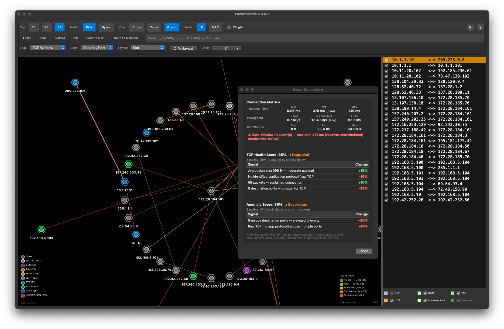
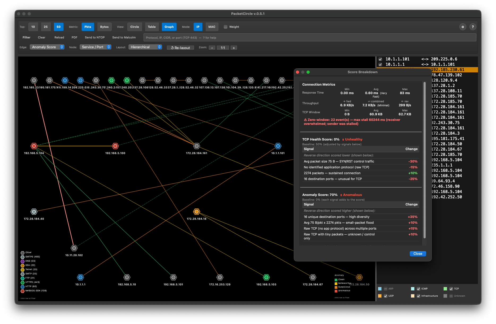
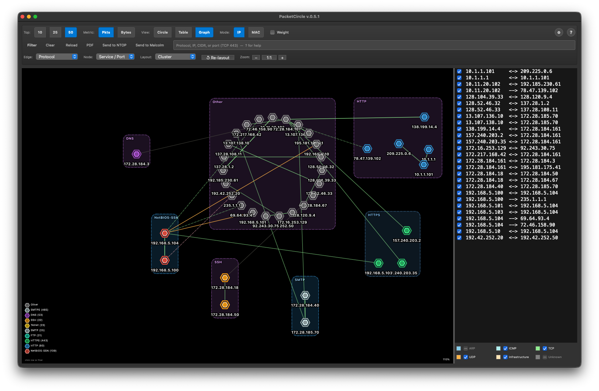

# PacketCircle

<p align="center">
  
</p>

[](CHANGELOG.md)
[](CHANGELOG.md)
[](LICENSE)
[](https://www.wireshark.org/)
[](https://www.qt.io/)
[](installer/macos-universal/)
[](installer/linux-x86_64/)
[](installer/windows-x86_64/)

**A native Wireshark plugin that turns packet captures into interactive circle and graph diagrams** — with protocol color coding, deep protocol inspection, traffic volume indicators, and PDF report export.

> **Beta Status**: v0.5.2, fully functional, actively developed. Report issues via [GitHub Issues](https://github.com/netwho/PacketCircle/issues).

---

## Demo / Training Videos

▶️ **[Watch the intro video on YouTube](https://youtu.be/jg4O9rdUp_0)** — PacketCircle in action in under 4 minutes.

▶️ **[Watch the v0.4.x feature video on YouTube](https://www.youtube.com/watch?v=Q83vcK8hXJo)** — protocol info dialogs, Wi-Fi mode, bidirectional filtering.

▶️ **[Watch the v0.5.x feature video on YouTube](https://youtu.be/p4OCaTHJlEI?si=yI9d8Ab0xCv0sNDU)** — Graph Mode, Security Workflow & More

▶️ **[PacketCircle v0.4.7 Quickstart Training on YouTube](https://youtu.be/f1wBlKo-7nI)** — step-by-step walkthrough for new users.

📖 **[Training materials](training/TRAINING.md)** — written guides, use-case walkthroughs, and classroom exercises.

---

## What It Does


*Hosts as nodes on a circle, connections as arcs — colored by protocol, weighted by traffic volume.*

**See who is talking to whom, using which protocol, and how much** — instantly, from any PCAP or live capture.

| Capability | Description |
|---|---|
| **Circle visualization** | Hosts as nodes, connections as arcs — colored by protocol, sized by volume |
| **Graph view** | Interactive node-link topology diagram with 8 layouts, TCP Health / Anomaly Score / High Risk edge coloring, node color modes, and score breakdowns — enable via Experimental install |
| **20+ protocol info dialogs** | Right-click any connection: TLS certs, HTTP headers, FTP credentials, DNS answers, SSH key exchange, Kerberos tickets, and more |
| **Wi-Fi monitoring mode** | Visualize 802.11 captures with RSSI signal-quality color coding |
| **Smart search** | Search by IP, CIDR, port (`TCP 443`), protocol keyword (`TLS`, `SSH`, `SNMP`, …), or any Wireshark display filter |
| **Wireshark integration** | Apply display filters, follow TCP streams, open throughput/RTT graphs — all from within PacketCircle |
| **ntopng & Malcolm/Arkime** | One-click send to ntopng or upload PCAP to Malcolm/Arkime with automatic Arkime session filter |
| **3-page PDF reports** | Cover page with metadata, visualization + pair list, and plain-language explanation page |
| **Cross-platform** | macOS Universal Binary (Intel + Apple Silicon), Linux x86_64, Windows x86_64 |

---

## Screenshots

### Circle View & Filtering


*Select a pair and apply a precise Wireshark display filter directly from the circle.*

### Protocol Information Dialogs


*Right-click any connection line: HTTP, TLS/SSL, SMB, Kerberos, Email, SQL, VoIP — and 13 more protocols.*

### Wi-Fi Monitoring Mode


*802.11 captures: RSSI-based color coding (green = excellent, red = poor). Click any node for signal stats, frame breakdown, and management events.*

### Connection Popup & Context Menu


*Click a line to see per-port details. Right-click to filter, follow a TCP stream, or open protocol info.*

---

> **Experimental Feature — v0.5.2:** The Graph View screenshots below showcase a new layout engine introduced in v0.5.2. This feature is experimental; behaviour and UI may change in future releases.

### Graph View — Star Layout with TCP Window Analysis



*Star layout with TCP Window edge coloring: the busiest host anchors the centre; edge color reveals receiver-side buffer pressure — green = healthy, orange = constrained, red = zero-window stall.*

### Graph View — Hierarchical Layout with Anomaly Score



*Hierarchical layout with Anomaly Score edge coloring: hosts are ranked top-to-bottom by traffic role; edge color surfaces port scans, flood patterns, and exfiltration — green = normal, red = high anomaly.*

### Graph View — Cluster Layout by Protocol / Service



*Cluster layout with Protocol/Service node coloring: hosts are grouped by the services they provide. Cross-cluster edges immediately reveal unexpected inter-service communication.*

---

## Graph View

The Graph view renders the same communication pairs as an interactive node-link topology diagram. Switch to it with the **Graph** button in the toolbar — or enable it first via the **Experimental** installer option (see below).

Each host becomes a hexagonal node sized by traffic volume. Connections are edges colored by the selected mode:

| Edge Color Mode | What it shows |
|---|---|
| **TCP Health** | Green = healthy connection · Red = broken/refused/tiny-packet flood |
| **Anomaly Score** | Green = normal · Red = port scan, flood, or exfiltration pattern |
| **Response Time** | Green < 5 ms · Yellow 5–50 ms · Orange 200–500 ms · Red > 500 ms |
| **Throughput** | Blue < 10 KB/s → Red > 10 MB/s |
| **TCP Window** | Green = healthy buffer · Red = zero-window stalls |
| **High Risk** | Grey = safe · Yellow = SSH/SNMP · Orange = RDP/WinRM · Red = Telnet/FTP/VNC · Violet = VPN/TOR |
| **Protocol** | Same application protocol palette as Circle view |

Node color modes include **Role** (Internal/External/Broadcast), **Service/Port**, **Protocol**, and **Function** (Remote Access / Shell / Messaging / File Transfer).

**8 layout algorithms:** Force-directed · Star · Circular · Grid · Cluster · Concentric · Hierarchical · Radial — each optimized for a different analysis task. See [graph-layout.md](graph-layout.md) for details.

**Clicking an edge** in TCP Health or Anomaly Score mode opens a Score Breakdown showing every signal that contributed to the rating. For TCP connections, TCP Window statistics (min/max/avg window size, zero-window events) are also shown.

### Graph View in Wi-Fi Monitoring Mode

In Wi-Fi monitor-mode captures (802.11 / radiotap), application-layer protocol data is not available — all traffic appears at the MAC layer. The Graph view adapts: edge colors reflect **RSSI signal quality** (green = excellent ≥ −55 dBm → red = poor < −75 dBm) and TCP Health / Anomaly Score modes are not applicable.

The **Cluster layout** remains fully useful in Wi-Fi mode — it groups nodes by their 802.11 role rather than subnet:

| Cluster group | Members |
|---|---|
| **Access Points** | BSSID nodes (infrastructure mode APs) |
| **Data Stations** | Client devices exchanging data frames |
| **Management** | Nodes seen only in management frames (probes, beacons, auth) |
| **Broadcast / Multicast** | Broadcast and multicast MAC addresses |

This makes it easy to spot rogue APs, unassociated clients, and management-frame floods even without any IP or protocol context.

---

## Download & Install

### Option A — Download the installer package (macOS and Windows)

**[⬇ Download installer.zip](https://github.com/netwho/PacketCircle/raw/main/installer.zip)** — contains macOS and Windows installers

> **Linux users:** the zip does not include the Linux binaries (too large). Use **Option B** (git clone) instead — it's the preferred path for Linux anyway.

1. Download `installer.zip` and unzip it — you get an `installer/` folder with both versions
2. Open a terminal (macOS) or Command Prompt (Windows) and run the installer for your platform:

| Platform | Steps |
|---|---|
| **macOS** | `cd installer/macos-universal` → `chmod +x install.sh` → `./install.sh` |
| **Windows** | Open Command Prompt → `cd /d installer\windows-x86_64` → `install.bat` |

### Option B — Clone the repository (all platforms, recommended for Linux)

```bash
git clone https://github.com/netwho/PacketCircle.git
cd PacketCircle
```

Then run the installer for your platform from the `installer/` directory:

| Platform | Steps |
|---|---|
| **macOS** | `cd installer/macos-universal` → `chmod +x install.sh` → `./install.sh` |
| **Linux** | `cd installer/linux-x86_64` → `chmod +x install.sh` → `./install.sh` |
| **Windows** | Open Command Prompt → `cd /d installer\windows-x86_64` → `install.bat` |

---

### Installer options — Standard vs Experimental

All installers offer two **versions** and two **feature sets**:

**Version:**
- `v.0.5.2` (latest, default — just press Enter) — 3-page PDF reports, TCP Window analysis, all protocol info dialogs
- `v.0.4.7` — stable legacy release

**Feature set** (v.0.5.2 only):
- `Standard` (default — just press Enter) — Circle view, Table view, Wi-Fi mode, 20+ protocol info dialogs, PDF reports, ntopng/Malcolm integration
- `Experimental` — everything in Standard, plus the **Graph View** beta feature (interactive topology diagrams, health scoring, anomaly detection, 8 layout modes)

> The default is v.0.5.2 Standard. Just press Enter twice to install with no prompts.

---

> All installers detect your Wireshark version, show any existing installation, and offer uninstall. Just run and follow the prompts.

→ **Full installation guide, manual install, and uninstall:** [INSTALLATION.md](INSTALLATION.md)

---

## Supported Platforms

| Wireshark Version | macOS Universal | Windows x86_64 | Linux x86_64 |
|---|---|---|---|
| **4.6.x** | ✓ | ✓ | ✓ |
| **4.4.x** | — | — | ✓ |
| **4.2.x** | — | — | ✓ |
| **4.0.x** | — | — | ✓ ¹ |

> ¹ Wireshark 4.0.x on Linux requires Qt6 (`libqt6widgets6`). The installer detects this and offers to install it.

---

## Documentation

| Document | Contents |
|---|---|
| **[INSTALLATION.md](INSTALLATION.md)** | Platform installers, manual install, prerequisites, uninstall |
| **[FEATURES.md](FEATURES.md)** | Every feature explained with use cases and controls reference |
| **[QUICKSTART.md](QUICKSTART.md)** | First-use walkthrough — up and running in 5 minutes |
| **[TROUBLESHOOTING.md](TROUBLESHOOTING.md)** | Common errors, platform-specific fixes, diagnostic tools |
| **[PROTOCOL-INFO.md](PROTOCOL-INFO.md)** | All 20+ protocol info dialogs — fields extracted, trigger ports |
| **[graph-scores.md](graph-scores.md)** | Graph view scoring algorithms — TCP Health, Anomaly Score, TCP Window, High Risk |
| **[graph-layout.md](graph-layout.md)** | All 8 graph layout algorithms — how each works and when to use it |
| **[CHANGELOG.md](CHANGELOG.md)** | Full version history |

---

## License

GNU General Public License v2 — see [LICENSE](LICENSE).

## Acknowledgments

- **Wireshark development team** — for the outstanding dissector framework and plugin API that makes deep protocol inspection possible
- **Wireshark community** — for testing, feedback, and bug reports that shaped every release
- **AI-Assisted** — yes (Claude by Anthropic) — used for build system automation, installer scripting, cross-platform compatibility, protocol info dialogs, and documentation

---

**Built with ❤️ for the network analysis community** — [github.com/netwho/PacketCircle](https://github.com/netwho/PacketCircle)
